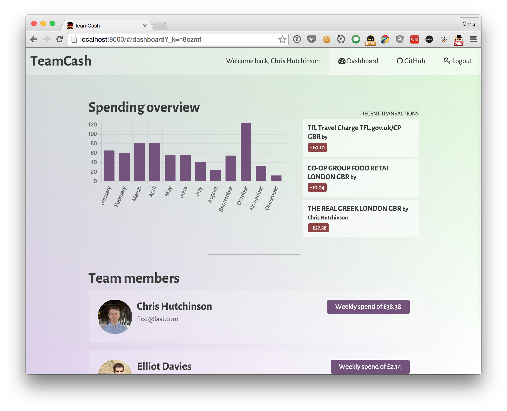

# TeamCash (name TBC)

Created by [Elliot Davies](http://www.github.com/elliotdavies) and [Chris Hutchinson](http://www.github.com/chrishutchinson) during [#mondohack III](https://attending.io/events/mondohack-3).

## About

TeamCash is a smart spending tracker for small teams and businesses, built with [Mondo](https://getmondo.co.uk/).

## Scenario #1

_That's right, scenarios._ You're a manager of a small team, and your team need company cards for work expenses. You give them cards, and they start spending your company's money. But wait! How do you know what they're spending? What if they're slipping in an expensive coffee every morning for themselves, or taking their mum out for dinner every Thursday evening (sweet, but not cool)?

You could go to your bank, ask for statements for all your team members and spend hours trawling through them all. You might even have a system for automatic tracking of their spending already, but damn, you probably have to boot up the old Windows machine in the corner of the office that runs IE6, just to access the interface that hasn't been updated since `<marquee>` tags were cool.

Wouldn't it be great if there was a modern, attractive, and integrated way of doing this? Well hot damn, TeamCash can do all of those things. Track your team, flag mysterious expenditures, generate digital and print reports and more!

## Scenario #2

Your staff are busy people. They're out flying around the world, and tracking their spending across all their projects can be hard. Are those travel costs for Project A or Project B? If only you could attach calendar events to your transactions, and generate reports for all expenditure on a specific event. Oh wait, with TeamCash, you can!

## Development

The app is made up two parts, a Node.js server and a ReactJS frontend. Both connect to a [Firebase](https://www.firebase.com/) for access to real-time data from Mondo.

To run locally:

1. Clone this repository
2. Run `$ npm install`
3. Copy `example.config.json` to `config.json`. See *Configuration* for more.
4. Run `$ npm start` to run the Node.js server using the `dist` version of the ReactJS app
5. Run `$ npm run webpack` to run the ReactJS app using [Webpack Dev Server](https://webpack.github.io/docs/webpack-dev-server.html)

To build an updated version of the ReactJS app into `/dist` run `$ npm run dist`.

## Configuration

- `client_id`: Mondo Client ID
- `client_secret`: Mondo Client Secret
- `server`: Local server address (e.g. `localhost` or `0.0.0.0`)
- `port`: Local port number for the Node.js server (the Webpack Dev Server will use 8000 by default)
- `database`: The URL to your Firebase database
- `staging_auth_url`: The Mondo staging auth URL, you probably won't need to change this
- `auth_url`: The Mondo auth URL, you probably won't need to change this
- `staging_api_url`: The Mondo staging API URL, you probably won't need to change this
- `api_url`: The Mondo API URL, you probably won't need to change this
- `is_prod`: Boolean to determine if your app should use the production or staging Mondo environment
